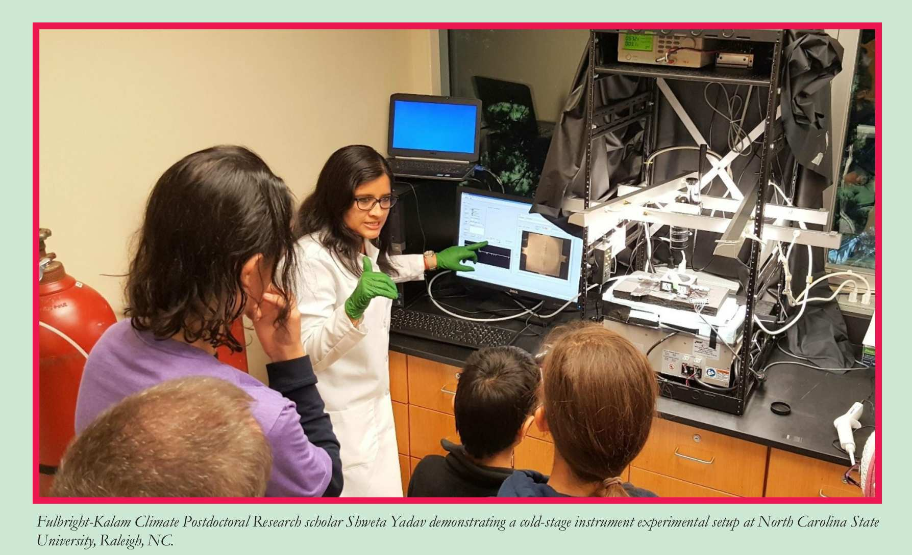

# Home

## Facility Overview

CIF makes the ice nucleation cold-stage available to the atmospheric science community for investigation of ice nucleating particle concentrations. The CIF comprises the cold-stage cell, cooling system, observation optics, software for data acquisition and image analysis, and a set of samplers. 

The cold stage consists of a thermally controlled surface. The surface is cooled using a series of thermoelectric elements. In this version, the surface is imaged using a macrolens, but the optics can be switched to a stereomicroscope. The instrument can be operated in multiple modes, utilizing water droplet volumes ranging over approximately 4 orders of magnitude from 0.25 nL to 1 muL. 

## Contact

Interested? Contact: Markus Petters, [mdpetter@ncsu.edu](mailto:mdpetter@ncsu.edu).

## Acknowledgements

The instrument was developed and characterized using funding from the National Science Foundation awards NSF-AGS 1010851 and NSF-AGS 1450690. The CIF is supported via NSF-AGS 2112978. 

