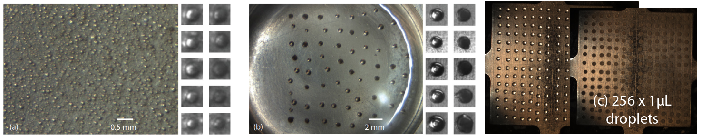
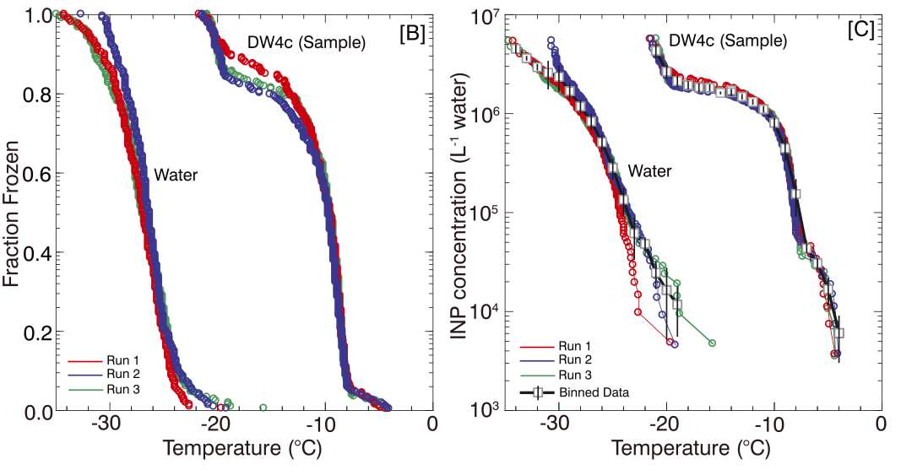
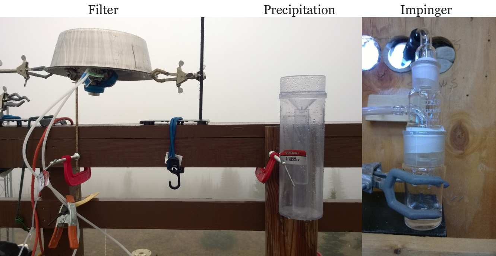

# Introduction

The main purpose of the instrument is to observe the freezing nucleation process of supercooled water droplets. The instrument is suitable for studying ambient ice nucleating particle concentrations and laboratory-based process-level studies of the nucleation process. 

Liquid droplets are placed on a surface. The surface is cooled at a constant rate, typically at 1-2 K min-1. Time lapse photography is used to record images of the drops every few seconds. When the droplets freeze, they turn opaque. The change in brightness is detected using an [automated image detection code](https://github.com/CIF-Cold-Stage/Drop-Freezing-Detection.git). Figure 1 shows a visual representation of droplets placed on the cold stage.

**Figure 1.** Drop volumes used by the NC State CS. (a) A section of the field of view for an experiment using ~0.25 nL immersed in oil. The small images to the right depict enlarged examples of individual drops prior to freezing (left column) and after freezing (right column), (b) same as (a) but for ~150 nL immerserd in oil, (c) 1 muL placed on four hydrophobic glass slides. Drops are placed using an electronic pipette. Images in (a) and (b) are obtained using a stereo microscope, the images in (c) with a macro lens.

Figure 2 shows an example INP spectrum for a liquid sample contrasted with HPLC grade ultrapure water that was prefiltered using a 0.02-μm pore filter.
Three independent repeat experiments with the sample suspension are shown. A repeat consists of placing a fresh set of drops on the cold stage. The medium temperature of the observed freeze events in the ≈1 mm size ultrapure water drops exceeds the homogeneous freezing temperature of pure water by ≈ 7 °C
and can be attributed to size of drops, small size of INP present (which could not be filtered), or substrate defects. The INP concentration of ultrapure water at T = −26 °C is 9 × 105 L−1 water, a value consistent with HPLC water samples observed by others. Sample data that contain INP appear to the right of the ultrapure water curve.

**Figure 2.** *Source:* Yadav et al. (2019, JGR). Example determination of INP spectra for the prefiltered HPLC grade ultrapure water and and extracted filter sample (DW4c). (B) Fraction frozen versus temperature for three individual runs, and (C) cumulative INP versus temperature. For each sample the three experiments are collated and binned into 1 °C intervals and the mean INP concentration ±1 standard deviation is reported if two or more freeze events were recorded within the bin. Gray squares show binned data. Black vertical bars show one standard deviation of INP concentration within the bin. 

# Samplers

Figure 3 shows sampling methods that are associated with the CIF. The main method involves 0.2-μm nucleopore polycarbonate filters, followed by resuspension in prefiltered HPLC grade ultrapure water. Alternatively, collection of precipitation samples using rain gauges, and collection of particles using an impinger sampler can be used. For the impinger sampler the collection efficiency exceeds 80 % for particles larger than 200 nm, approaches 100 % for particles larger than 1 µm, and drops again for particles > 5 µm due to impaction losses. When analyzing suspensions from filter samples or impingers, INP L−1 air can be reconstructed from the total sampling time, is the average flow rate through the sampler, and the volume of water (L) in which the filter is dissolved. For rainwater samples, mean INP concentrations L−1 water can be converted to concentration L−1 air assuming a condensed water content of 0.4 g/m−3.

**Figure 3.** Samplers associated with the CIF.

# Example use cases

- Quantification of ice nucleating particle concentration in atmospheric aerosol, rainwater, and snow melt.
- Laboratory studies of ice nucleation processes, including time dependence of heterogeneous freezing nucleation and determination of ice nucleation active site density of different materials.
- Inclusion in teaching (either via teacher demonstration or hands-on use by students) to learn about the freezing of water and/or important cloud ice processes. 
- Inclusion in teaching about aerosol sampling, instrument design and construction, and writing of data acquisition systems.

# References

1. Cornwell, G. C.; Sultana, C. M.; Petters, M. D.; Al-Mahat, H.; Rothfuss, N. E.; DeMott, P. J.; Martin, A. C.; Prather, K. A. Discrimination between Dust and Bioaerosol by Aerosol Time-of-Flight Mass Spectrometry. Aerosol Sci. & Technol., under revision.

1. Yadav, S.; Venezia, R. E.; Paerl, R. W.; Petters, M. D. Characterization of Ice Nucleating Particles Over Northern India. J. Geophys. Res. Atmospheres 2019, 124 (19), 10467–10482. https://doi.org/10.1029/2019JD030702.

2. Hiranuma, N.; Adachi, K.; Bell, D. M.; Belosi, F.; Beydoun, H.; Bhaduri, B.; Bingemer, H.; Budke, C.; Clemen, H.-C.; Conen, F.; Cory, K. M.; Curtius, J.; DeMott, P. J.; Eppers, O.; Grawe, S.; Hartmann, S.; Hoffmann, N.; Höhler, K.; Jantsch, E.; Kiselev, A.; Koop, T.; Kulkarni, G.; Mayer, A.; Murakami, M.; Murray, B. J.; Nicosia, A.; Petters, M. D.; Piazza, M.; Polen, M.; Reicher, N.; Rudich, Y.; Saito, A.; Santachiara, G.; Schiebel, T.; Schill, G. P.; Schneider, J.; Segev, L.; Stopelli, E.; Sullivan, R. C.; Suski, K.; Szakáll, M.; Tajiri, T.; Taylor, H.; Tobo, Y.; Ullrich, R.; Weber, D.; Wex, H.; Whale, T. F.; Whiteside, C. L.; Yamashita, K.; Zelenyuk, A.; Möhler, O. A Comprehensive Characterization of Ice Nucleation by Three Different Types of Cellulose Particles Immersed in Water. Atmospheric Chem. Phys. 2019, 19 (7), 4823–4849. https://doi.org/10.5194/acp-19-4823-2019.

3. DeMott, P. J.; Möhler, O.; Cziczo, D. J.; Hiranuma, N.; Petters, M. D.; Petters, S. S.; Belosi, F.; Bingemer, H. G.; Brooks, S. D.; Budke, C.; Burkert-Kohn, M.; Collier, K. N.; Danielczok, A.; Eppers, O.; Felgitsch, L.; Garimella, S.; Grothe, H.; Herenz, P.; Hill, T. C. J.; Höhler, K.; Kanji, Z. A.; Kiselev, A.; Koop, T.; Kristensen, T. B.; Krüger, K.; Kulkarni, G.; Levin, E. J. T.; Murray, B. J.; Nicosia, A.; O’Sullivan, D.; Peckaus, A.; Polen, M. J.; Price, H. C.; Reicher, N.; Rothenberg, D. A.; Rudich, Y.; Santachiara, G.; Schiebel, T.; Schrod, J.; Seifried, T. M.; Stratmann, F.; Sullivan, R. C.; Suski, K. J.; Szakáll, M.; Taylor, H. P.; Ullrich, R.; Vergara-Temprado, J.; Wagner, R.; Whale, T. F.; Weber, D.; Welti, A.; Wilson, T. W.; Wolf, M. J.; Zenker, J. The Fifth International Workshop on Ice Nucleation Phase 2 (FIN-02): Laboratory Intercomparison of Ice Nucleation Measurements. Atmospheric Meas. Tech. 2018, 2018 (11), 6231–6257. https://doi.org/10.5194/amt-11-6231-2018.

4. DeMott, P. J.; Hill, T. C. J.; Petters, M. D.; Bertram, A. K.; Tobo, Y.; Mason, R. H.; Suski, K. J.; McCluskey, C. S.; Levin, E. J. T.; Schill, G. P.; Boose, Y.; Rauker, A. M.; Miller, A. J.; Zaragoza, J.; Rocci, K.; Rothfuss, N. E.; Taylor, H. P.; Hader, J. D.; Chou, C.; Huffman, J. A.; Pöschl, U.; Prenni, A. J.; Kreidenweis, S. M. Comparative Measurements of Ambient Atmospheric Concentrations of Ice Nucleating Particles Using Multiple Immersion Freezing Methods and a Continuous Flow Diffusion Chamber. Atmospheric Chem. Phys. 2017, 17 (18), 11227–11245. https://doi.org/10.5194/acp-17-11227-2017.

5. Petters, M. D.; Wright, T. P. Revisiting Ice Nucleation from Precipitation Samples. Geophys. Res. Lett. 2015, 42 (20), 8758–8766. https://doi.org/10.1002/2015GL065733.

6. Hiranuma, N.; Augustin-Bauditz, S.; Bingemer, H.; Budke, C.; Curtius, J.; Danielczok, A.; Diehl, K.; Dreischmeier, K.; Ebert, M.; Frank, F.; Hoffmann, N.; Kandler, K.; Kiselev, A.; Koop, T.; Leisner, T.; Möhler, O.; Nillius, B.; Peckhaus, A.; Rose, D.; Weinbruch, S.; Wex, H.; Boose, Y.; DeMott, P. J.; Hader, J. D.; Hill, T. C. J.; Kanji, Z. A.; Kulkarni, G.; Levin, E. J. T.; McCluskey, C. S.; Murakami, M.; Murray, B. J.; Niedermeier, D.; Petters, M. D.; O’Sullivan, D.; Saito, A.; Schill, G. P.; Tajiri, T.; Tolbert, M. A.; Welti, A.; Whale, T. F.; Wright, T. P.; Yamashita, K. A Comprehensive Laboratory Study on the Immersion Freezing Behavior of Illite NX Particles: A Comparison of 17 Ice Nucleation Measurement Techniques. Atmospheric Chem. Phys. 2015, 15 (5), 2489–2518. https://doi.org/10.5194/acp-15-2489-2015.

7. Wright, T. P.; Hader, J. D.; McMeeking, G. R.; Petters, M. D. High Relative Humidity as a Trigger for Widespread Release of Ice Nuclei. Aerosol Sci. Technol. 2014, 48 (11), i–v. https://doi.org/10.1080/02786826.2014.968244.

8. Hader, J. D.; Wright, T. P.; Petters, M. D. Contribution of Pollen to Atmospheric Ice Nuclei Concentrations. Atmospheric Chem. Phys. 2014, 14 (11), 5433–5449. https://doi.org/10.5194/acp-14-5433-2014.

9. Wright, T. P.; Petters, M. D. The Role of Time in Heterogeneous Freezing Nucleation. J. Geophys. Res. Atmospheres 2013, 118 (9), 3731–3743. https://doi.org/10.1002/jgrd.50365.

10. Wright, T. P.; Petters, M. D.; Hader, J. D.; Morton, T.; Holder, A. L. Minimal Cooling Rate Dependence of Ice Nuclei Activity in the Immersion Mode. J. Geophys. Res. Atmospheres 2013, 118 (18), 10,535-10,543. https://doi.org/10.1002/jgrd.50810.
